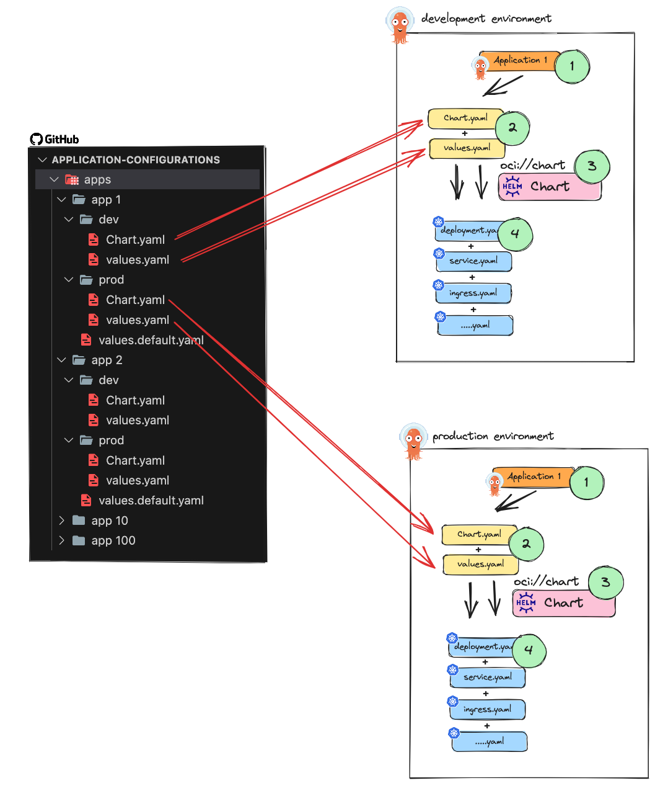

**1- "ApplicationSet" will generate "Application"**
**2- Based on the configuration of the "Application" ArgoCD will pull the Chart.yaml and values.yaml from the app1 folder**
**3- ArgocdCD will pull the "microservice" chart from the OCI registry and generate manifest**
**4- ArgoCD will apply the manifest to the cluster.**